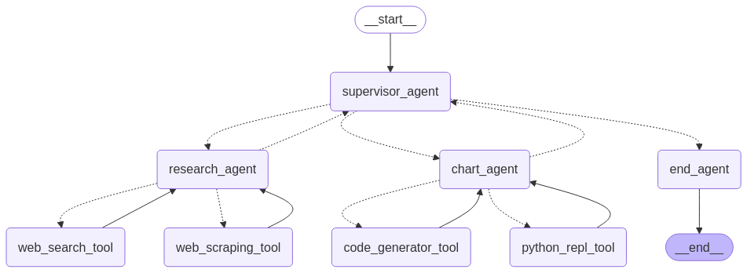

<div align="center">

# DataLens: The Intelligent Chart Generator 📊

<div align="center" style="display: flex; flex-wrap: wrap; gap: 10px; justify-content: center">
  
  
  
  
  
  
  
  
  
  
</div>

## Turn your words into stunning data visuals, effortlessly! ✨

  <p align="center">
    <b>Intelligent extraction | Custom visualizations | Advanced analysis</b>
  </p>
</div>

<p align="center">
  
</p>

# Overview

DataLens is an advanced agentic framework built on LangGraph that transforms natural language queries into data-driven visualizations. The system autonomously navigates the web using Tavily search and BeautifulSoup scraping to gather relevant information, then intelligently processes and visualizes this data through customized charts—all orchestrated by a sophisticated AI agent powered by OpenAI's models.

## Core Capabilities

- Orchestrated workflow using LangGraph to coordinate specialized agents
- Web data collection through Tavily search and BeautifulSoup scraping
- Dynamic chart generation with matplotlib and seaborn
- Natural language interface for data visualization requests
- Performance monitoring via LangSmith

## Setup

1. Clone this repository
   ```bash
   git clone https://github.com/yourusername/DataLens.git
   cd DataLens
   ```

2. Install dependencies:
   ```bash
   pip install -r requirements.txt
   ```
3. Configure environment variables in `.env`:
   ```
   OPENAI_API_KEY=your_openai_api_key
   TAVILY_API_KEY=your_tavily_api_key
   LANGSMITH_TRACING=true
   LANGSMITH_ENDPOINT=https://api.smith.langchain.com
   LANGSMITH_API_KEY=your_langsmith_api_key
   LANGSMITH_PROJECT="chart-agent"
   ```
4. Run the notebook: `execute.ipynb`

## Architecture

DataLens employs a multi-agent system built on LangGraph that processes natural language queries through three specialized components:

- **Supervisor Agent**: Coordinates workflow and evaluates output quality
- **Research Agent**: Gathers relevant data through web search and content extraction
- **Chart Agent**: Transforms data into visualizations using dynamically generated code

This architecture enables a seamless pipeline from query to visualization, with each agent making autonomous decisions within its domain while maintaining coherent workflow progression.

## Components

- **Data Collection**: Web search and scraping tools for gathering relevant information
- **Visualization Engine**: Code generation and execution for creating customized charts
- **Agent Framework**: LangGraph-based coordination of specialized AI agents
- **Tool Integration**: Modular components for data processing and visualization

